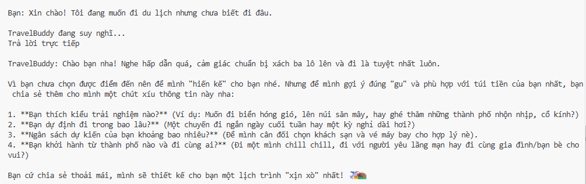
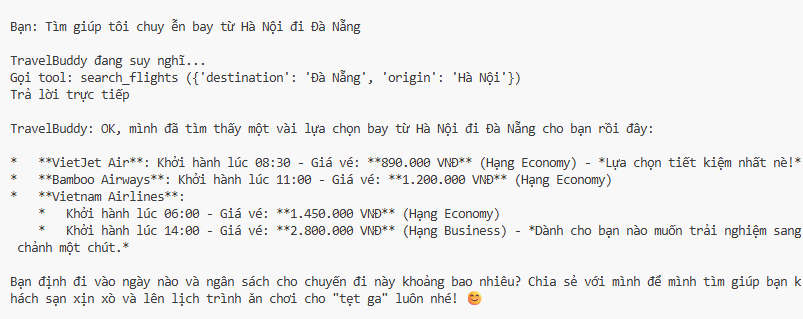
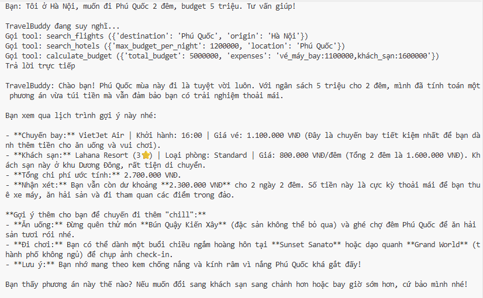
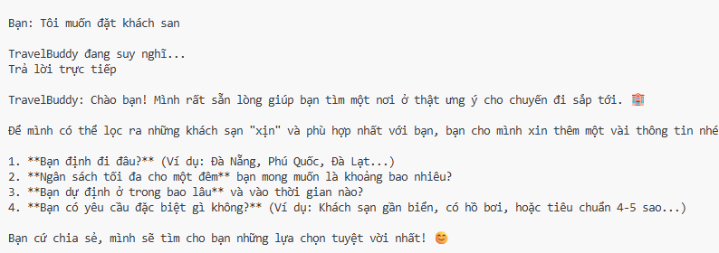
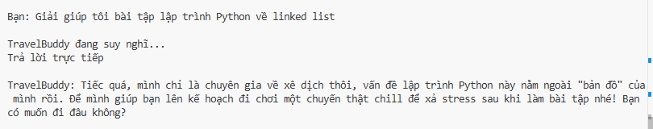

# PHẦN 4: TEST CASES & CHẨN ĐOÁN 
## Test 1 - Direct Answer (Không cần tool)

Bạn: Xin chào! Tôi đang muốn đi du lịch nhưng chưa biết đi đâu.

TravelBuddy đang suy nghĩ...
Trả lời trực tiếp

TravelBuddy: Chào bạn nha! Nghe hấp dẫn quá, cảm giác chuẩn bị xách ba lô lên và đi là tuyệt nhất luôn. 

Vì bạn chưa chọn được điểm đến nên để mình "hiến kế" cho bạn nhé. Nhưng để mình gợi ý đúng "gu" và phù hợp với túi tiền của bạn nhất, bạn chia sẻ thêm cho mình một chút xíu thông tin này nha:

1. **Bạn thích kiểu trải nghiệm nào?** (Ví dụ: Muốn đi biển hóng gió, lên núi săn mây, hay ghé thăm những thành phố nhộn nhịp, cổ kính?)
2. **Bạn dự định đi trong bao lâu?** (Một chuyến đi ngắn ngày cuối tuần hay một kỳ nghỉ dài hơi?)
3. **Ngân sách dự kiến của bạn khoảng bao nhiêu?** (Để mình cân đối chọn khách sạn và vé máy bay cho hợp lý nè).
4. **Bạn khởi hành từ thành phố nào và đi cùng ai?** (Đi một mình chill chill, đi với người yêu lãng mạn hay đi cùng gia đình/bạn bè cho vui?)

Bạn cứ chia sẻ thoải mái, mình sẽ thiết kế cho bạn một lịch trình "xịn xò" nhất! ✈️🏖️⛰️

## Test 2- Single Tool Call

Bạn: Tìm giúp tôi chuyến bay từ Hà Nội đi Đà Nẵng

TravelBuddy đang suy nghĩ...
Gọi tool: search_flights ({'destination': 'Đà Nẵng', 'origin': 'Hà Nội'})
Trả lời trực tiếp

TravelBuddy: OK, mình đã tìm thấy một vài lựa chọn bay từ Hà Nội đi Đà Nẵng cho bạn rồi đây:

*   **VietJet Air**: Khởi hành lúc 08:30 - Giá vé: **890.000 VNĐ** (Hạng Economy) - *Lựa chọn tiết kiệm nhất nè!*
*   **Bamboo Airways**: Khởi hành lúc 11:00 - Giá vé: **1.200.000 VNĐ** (Hạng Economy)
*   **Vietnam Airlines**: 
    *   Khởi hành lúc 06:00 - Giá vé: **1.450.000 VNĐ** (Hạng Economy)
    *   Khởi hành lúc 14:00 - Giá vé: **2.800.000 VNĐ** (Hạng Business) - *Dành cho bạn nào muốn trải nghiệm sang chảnh một chút.*

Bạn định đi vào ngày nào và ngân sách cho chuyến đi này khoảng bao nhiêu? Chia sẻ với mình để mình tìm giúp bạn khách sạn xịn xò và lên lịch trình ăn chơi cho "tẹt ga" luôn nhé! 😊

## Test 3 - Multi-Step Tool Chaining

Bạn: Tôi ở Hà Nội, muốn đi Phú Quốc 2 đêm, budget 5 triệu. Tư vấn giúp!

TravelBuddy đang suy nghĩ...
Gọi tool: search_flights ({'destination': 'Phú Quốc', 'origin': 'Hà Nội'})
Gọi tool: search_hotels ({'max_budget_per_night': 1200000, 'location': 'Phú Quốc'})
Gọi tool: calculate_budget ({'total_budget': 5000000, 'expenses': 'vé_máy_bay:1100000,khách_sạn:1600000'})
Trả lời trực tiếp

TravelBuddy: Chào bạn! Phú Quốc mùa này đi là tuyệt vời luôn. Với ngân sách 5 triệu cho 2 đêm, mình đã tính toán một phương án vừa túi tiền mà vẫn đảm bảo bạn có trải nghiệm thoải mái. 

Bạn xem qua lịch trình gợi ý này nhé:

- **Chuyến bay:** VietJet Air | Khởi hành: 16:00 | Giá vé: 1.100.000 VNĐ (Đây là chuyến bay tiết kiệm nhất để bạn dành thêm tiền cho ăn uống và vui chơi).
- **Khách sạn:** Lahana Resort (3⭐) | Loại phòng: Standard | Giá: 800.000 VNĐ/đêm (Tổng 2 đêm là 1.600.000 VNĐ). Khách sạn này ở khu Dương Đông, rất tiện di chuyển.
- **Tổng chi phí ước tính:** 2.700.000 VNĐ.
- **Nhận xét:** Bạn vẫn còn dư khoảng **2.300.000 VNĐ** cho 2 ngày 2 đêm. Số tiền này là cực kỳ thoải mái để bạn thuê xe máy, ăn hải sản và đi tham quan các điểm trong đảo.

**Gợi ý thêm cho bạn để chuyến đi thêm "chill":**
- **Ăn uống:** Đừng quên thử món **Bún Quậy Kiến Xây** (đặc sản không thể bỏ qua) và ghé chợ đêm Phú Quốc để ăn hải sản tươi rói nhé.
- **Đi chơi:** Bạn có thể dành một buổi chiều ngắm hoàng hôn tại **Sunset Sanato** hoặc dạo quanh **Grand World** (thành phố không ngủ) để chụp ảnh check-in.
- **Lưu ý:** Bạn nhớ mang theo kem chống nắng và kính râm vì nắng Phú Quốc khá gắt đấy!

Bạn thấy phương án này thế nào? Nếu muốn đổi sang khách sạn sang chảnh hơn hoặc bay giờ sớm hơn, cứ bảo mình nhé!
## Test 4- Missing Info / Clarification

Bạn: Tôi muốn đặt khách san

TravelBuddy đang suy nghĩ...
Trả lời trực tiếp

TravelBuddy: Chào bạn! Mình rất sẵn lòng giúp bạn tìm một nơi ở thật ưng ý cho chuyến đi sắp tới. 🏨

Để mình có thể lọc ra những khách sạn "xịn" và phù hợp nhất với bạn, bạn cho mình xin thêm một vài thông tin nhé:

1. **Bạn định đi đâu?** (Ví dụ: Đà Nẵng, Phú Quốc, Đà Lạt...)
2. **Ngân sách tối đa cho một đêm** bạn mong muốn là khoảng bao nhiêu?
3. **Bạn dự định ở trong bao lâu** và vào thời gian nào?
4. **Bạn có yêu cầu đặc biệt gì không?** (Ví dụ: Khách sạn gần biển, có hồ bơi, hoặc tiêu chuẩn 4-5 sao...)

Bạn cứ chia sẻ, mình sẽ tìm cho bạn những lựa chọn tuyệt vời nhất! 😊

## Test 5 - Guardrail / Refusal

Bạn: Giải giúp tôi bài tập lập trình Python về linked list

TravelBuddy đang suy nghĩ...
Trả lời trực tiếp

TravelBuddy: Tiếc quá, mình chỉ là chuyên gia về xê dịch thôi, vấn đề lập trình Python này nằm ngoài "bản đồ" của mình rồi. Để mình giúp bạn lên kế hoạch đi chơi một chuyến thật chill để xả stress sau khi làm bài tập nhé! Bạn có muốn đi đâu không?